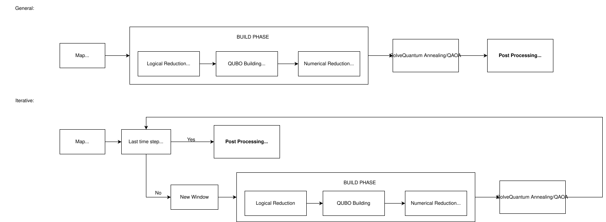

# Spooky - Quantum Multi-Robot Path Planning

[](https://arxiv.org/abs/2602.14799)

> **⚠️ Alpha Release**: This project is under active development and is being prepared for academic publication. APIs and features may change.

A hybrid quantum-classical framework for multi-robot path planning using QUBO (Quadratic Unconstrained Binary Optimization) formulations. Spooky leverages quantum annealing and gate-based quantum algorithms to solve complex navigation problems in both grid and graph environments.

## ✨ Key Features

- **Hybrid Quantum-Classical Solving**: Support for D-Wave quantum annealers, PennyLane QAOA, and classical simulated annealing
- **Multi-Robot Coordination**: Simultaneous path planning for multiple robots with collision avoidance
- **Flexible Environment Representation**: Works with both grid-based and graph-based maps
- **Windowed Solving**: Overcomes qubit limitations by solving paths in sliding windows
- **Advanced Preprocessing**: BFS-based variable fixing and dead-end avoidance
- **Comprehensive Benchmarking**: Built-in tools for performance analysis and validation
- **Visualization Tools**: Real-time visualization of paths, energy landscapes, and solving progress

## 🏗️ Architecture

```
quantum_nav/
├── quantum/              # Core quantum solver package
│   ├── builder/         # QUBO formulation builders (grid & graph)
│   ├── solvers/         # Quantum and classical solver interfaces
│   ├── config/          # Configuration management and parsers
│   ├── benchmark/       # Benchmarking and performance analysis
│   ├── utils/           # Utility functions for path handling
│   ├── map.py           # Environment representation (Grid/Graph)
│   ├── pathFormulation.py  # Problem formulation
│   └── qubo.py          # Reference script for experiments
└── fastapi_app/         # FastAPI server for remote solving
```

## 🔄 Solving Pipeline



**General (top):** the map enters a Build Phase (Logical Reduction → QUBO Building → Numerical Reduction), then goes to Solve and Post-processing.  
**Iterative (bottom):** at each window the solver checks whether the last timestep or goal is reached. If yes, post-processing runs. If no, a new window triggers another Build Phase → Solve cycle, and the result feeds back into the next iteration.

| Stage | What happens |
|---|---|
| **Logical Reduction** | BFS forward-reachability per robot fixes start/goal variables and computes the sparse `_active_cells` set — constraints are only built over reachable positions. |
| **Build QUBO** | Penalty terms (one-hot, adjacency, start/goal, lock-after-goal, backtracking, collision) are applied exclusively over `_active_cells`, keeping the matrix small. |
| **Numerical Reduction** | `reduce_diag_fixed_vars_iterative()` eliminates variables whose diagonal coefficient dominates all off-diagonal interactions, propagating fixings until convergence. |
| **Solve** | The reduced QUBO (optionally normalized) is submitted to the selected backend. |
| **Post-process** | Fixed variables are merged back into the raw sample, the path is decoded, invalid moves are detected and corrected, and the window advances. |

## 🚀 Installation

### Basic Installation

```bash
# Clone the repository
git clone https://github.com/JavideuS/Spooky.git
cd Spooky

# Create virtual environment (recommended)
python -m venv venv
source venv/bin/activate  # On Windows: venv\Scripts\activate

# Install core dependencies
pip install -e .

# Generate map files from YAML definitions (optional - maps are pre-generated)
python quantum/maps/generate_all_maps.py
```

### Optional Dependencies

```bash
# For PennyLane GPU acceleration (requires NVIDIA CUDA)
pip install -e ".[gpu]"

# For D-Wave quantum annealing
pip install -e ".[dwave]"

# For IBM Quantum hardware access
pip install -e ".[ibm]"

# For Jupyter notebook support
pip install -e ".[jupyter]"

# Install all optional dependencies
pip install -e ".[gpu,dwave,ibm,jupyter]"

# To install all
pip install -e ".[all]"
```

## 📖 Quick Start

> **Note**: Comprehensive usage examples and tutorials are currently being developed. The following demonstrates basic usage patterns.

### Command-Line Interface

After installation, the `spooky-solve` command is available from anywhere:

```bash
# D-Wave
spooky-solve --map quantum/maps/synthetic/10x10/obs10x10_hard --problem four_robots

# PennyLane (GPU)
spooky-solve --map quantum/maps/synthetic/5x5/obs5x5_hard --problem hard --solver pennylane --device lightning.gpu --benchmark --num-runs 5

# Qiskit (IBM Quantum hardware)
spooky-solve --map quantum/maps/synthetic/10x10/no_obs10x10 --problem two_robots --solver qiskit_remote --verbose 3
```

### Basic Single-Robot Navigation (Python Script)

```python
from quantum.pathFormulation import PathfindingProblem
from quantum.builder import QUBOBuilder
from quantum.solvers import SolverFactory

# Load problem from HDF5 map
problem = PathfindingProblem.from_unified_data(
    "maps/synthetic/10x10/no_obs10x10.h5",
    start=(0, 0),
    end=(9, 9),
    T=20
)

# Build QUBO formulation
builder = QUBOBuilder(problem, penalties={"K_hot": 10.0, "K_adj": 5.0})

# Solve using PennyLane QAOA
solver = SolverFactory.create_solver(
    solver="pennylane",
    layers=2,
    optimizer="QNG",
    opt_steps=30
)

# Get solution
result = solver.solve_qubo(builder)
path = solver.decode_path(result["solution"], problem)
print(f"Path found: {path}")
```

### Multi-Robot Coordination

```python
from quantum.robotConfiguration import RobotConfig

# Add multiple robots to the problem
robot1 = RobotConfig("Robot1", start=(0, 0), goal=(9, 9), priority=1)
robot2 = RobotConfig("Robot2", start=(9, 0), goal=(0, 9), priority=2)

problem.add_robot(robot1)
problem.add_robot(robot2)

# Build and solve with collision avoidance
builder = QUBOBuilder(problem, penalties=penalties)
result = solver.solve_qubo(builder)
```

## 🔧 Configuration

The system uses YAML configuration files for problem definitions and penalty weights:

- `config/config.yaml` - Problem definitions and penalty sets
- `config/materials.yaml` - Terrain material costs

See [`quantum/config/README.md`](quantum/config/README.md) for detailed configuration options.

## 📊 Benchmarking

Run benchmarks to evaluate solver performance:

```python
from quantum.benchmark import BenchmarkRunner

benchmark = BenchmarkRunner(
    builder,
    solver,
    num_runs=100,
    level=1  # Benchmark detail level
)
results = benchmark.run_build()
```

See [`quantum/benchmark/README.md`](quantum/benchmark/README.md) for benchmarking options.

## 🧪 Current Status & Roadmap

### Working Features

- ✅ QUBO formulation for grid and graph environments
- ✅ D-Wave quantum annealer integration
- ✅ PennyLane QAOA solver with GPU support
- ✅ Multi-robot path planning with collision avoidance
- ✅ Windowed solving for large problems
- ✅ Comprehensive benchmarking system

### In Development

- 🚧 FastAPI server for remote solving
- 🚧 Improved numerical stability in preprocessing
- 🚧 Edge collision handling in QUBO formulation
- 🚧 Automatic variable limit tuning

### Known Limitations

- Some edge cases in BFS preprocessing need refinement
- Performance tuning for specific problem types ongoing
- Documentation and examples are incomplete

## 🔌 Integration

Spooky is designed as a standalone planner. It can be used in two ways:

**As a Python library:**
```python
from quantum.pathFormulation import PathfindingProblem
from quantum.builder import QUBOBuilder
from quantum.solvers import SolverFactory
```

**Via FastAPI** (start the server in `fastapi_app/`):
```
POST /solve  →  { map, robots, solver_config }  →  { paths }
```

Robot framework integration (ROS2, DiMOS) is handled by [argOS](https://github.com/JavideuS/argOS), which uses Spooky as a planning backend.

## 🤝 Contributing

This project is currently in active research and development. Contributions, bug reports, and suggestions are welcome! Please note that the codebase is evolving rapidly as we prepare for academic publication.

## 📄 License

This project is licensed under the Apache License 2.0 - see the [LICENSE](LICENSE) file for details.

The academic paper is licensed under the [Creative Commons Attribution 4.0 International License (CC BY 4.0)](http://creativecommons.org/licenses/by/4.0/).

## 📧 Contact

**JavideuS** - javi.rm2005@gmail.com

## 🙏 Acknowledgments

This project uses:

- [PennyLane](https://pennylane.ai/) for quantum circuit simulation and optimization
- [D-Wave Ocean SDK](https://ocean.dwavesys.com/) for quantum annealing
- [Qiskit](https://qiskit.org/) for IBM Quantum hardware access

## 📖 Citation

If you use this software in your research, please cite the paper:

**Scalable Multi-Robot Path Planning via Quadratic Unconstrained Binary Optimization**  
_Javier González Villasmil, et al._  
arXiv preprint arXiv:2602.14799, 2026.

```bibtex
@misc{gonzalezvillasmil2026scalablemultirobotpathplanning,
      title={Scalable Multi-Robot Path Planning via Quadratic Unconstrained Binary Optimization},
      author={Javier González Villasmil et al.},
      year={2026},
      eprint={2602.14799},
      archivePrefix={arXiv},
      primaryClass={cs.RO},
      url={https://arxiv.org/abs/2602.14799},
}
```

---

**Note**: This is an active research project. For the most up-to-date information, please check the repository regularly or contact the author.
