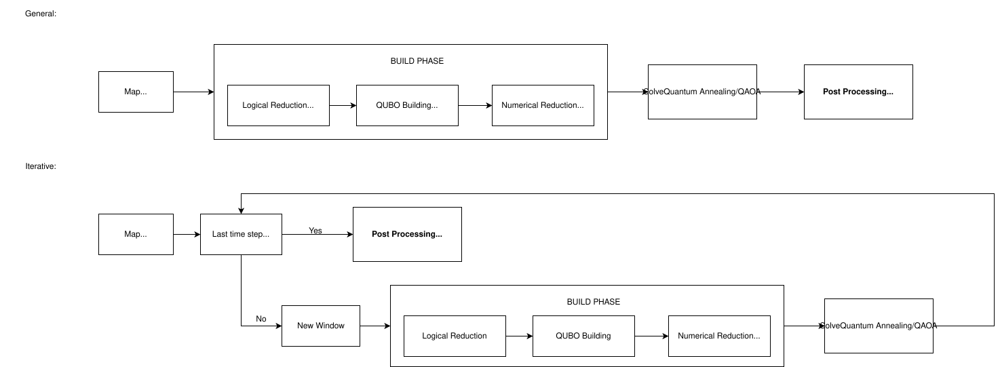

# Quantum Navigation Core

The `quantum` package is the heart of the Quantum Navigation project. It implements a hybrid quantum-classical approach to multi-robot path planning, utilizing QUBO (Quadratic Unconstrained Binary Optimization) formulations to solve complex navigation tasks.

For theoretical background and formulation details, please refer to our paper: [**Scalable Multi-Robot Path Planning via Quadratic Unconstrained Binary Optimization**](https://arxiv.org/abs/2602.14799).

## Package Structure

- **`builder/`**: Constructs the mathematical models (QUBOs) from problem definitions. Contains logic for grid and graph-based environments.
- **`solvers/`**: Interfaces for various quantum and classical solvers (DWave, PennyLane, Simulated Annealing).
- **`config/`**: Configuration management, file parsing (YAML, HDF5), and ROS integration tools.
- **`utils/`**: Shared utility functions for path handling and data manipulation.
- **`benchmark/`**: Tools for benchmarking solver performance and accuracy.
- **`hardware/`**: Real-QPU telemetry — pre-execution time estimates, IBM job/usage capture, IQM job timeline calibration. See `hardware/README.md`, especially before running real hardware jobs at scale (quota costs money).

## Core Modules

### Problem Formulation

- **`pathFormulation.py`**: Defines the mathematical formulation of the pathfinding problem. It translates high-level constraints (start, goal, obstacles) into the logic needed by the builders.
- **`map.py`**: Handles the internal representation of the environment, including grid data, obstacles, terrain costs, and graph topology.
- **`robotConfiguration.py`**: Manages the state and parameters of individual robots within the swarm.

### Visualization

- **`visualizer.py`**: Tools for visualizing the navigation process, including:
  - 2D grid maps with paths.
  - Energy landscapes of the quantum solution.
  - Real-time solving progress.

## Getting Started

To run a navigation task or benchmark, you can use the command-line interface `qubo_cli.py` for flexibility, or the `qubo.py` script for hands-on code modification.

### Using the CLI (`qubo_cli.py`)

The CLI allows you to specify maps, problems, solvers, and run benchmarks directly from the terminal:

```bash
# DWave example
python qubo_cli.py --map maps/synthetic/10x10/obs10x10_hard --problem four_robots

# Pennylane example
python qubo_cli.py --map maps/synthetic/10x10/no_obs10x10 --problem two_robots --var-limit 605 --solver pennylane --benchmark --num-runs 1
```

Run `python qubo_cli.py --help` to see all available options.

#### Pre-processing modes (`--preprocess`)

| Mode | Internal name | What it does |
|---|---|---|
| `safe` (default) | `bfs_safe` | Monotone BFS pruning only; the solver decides every window. The only pruning that cannot exclude a feasible solution, so QUBO-vs-ILP/CBS comparisons are like-for-like. Costs ~10–19x the variables of aggressive BFS. |
| `greedy` | `full` | Aggressive BFS plus greedy diagonal pinning. Fast, but the pinning often decides whole windows before the solver runs (it acts as a greedy prioritized planner). Default for `--solver pennylane`, whose statevector cannot hold `safe`-sized windows. |
| `raw` | `raw` | The old `--no-preprocess` loop: no pruning, no pinning, no correction retries. |

The internal names (`bfs_aggressive`, `bfs_safe`, `full`, `full_safe`) are also
accepted; results and sweep configs always record the internal name. On a local
statevector simulator a window too wide for available memory raises
`SimulatorCapacityError` (lower `--var-limit` or use `greedy`) instead of crashing.

A run that stops because a robot provably cannot reach its goal before its
deadline (shortest path > steps left) is reported as a windowing stall and
attributed to `windowing` in benchmark results.

#### Windowed multi-robot options (grid builder)

A window only sees a few steps, so the goal-approach term is what tells it where
to go, and the penalty balance decides whether robots yield or collide. These
options are off by default; recommended for multi-robot runs:

```bash
python qubo_cli.py --map maps/synthetic/10x10/obs10x10_hard --problem four_robots \
    --goal-distance bfs --progress-weight auto --obstacle-repulsion 0 \
    --allow-wait --approach-weight 3
```

| Option | Why |
|---|---|
| `--goal-distance bfs` | Per-robot shortest-path distance to the goal instead of Manhattan: sees walls and has no local minima. Identical to Manhattan on obstacle-free maps. |
| `--progress-weight auto` | Reward linear in progress made this window. The distance-scaling curve alone is nearly flat far from the goal (~0.01 per step at distance 16), too weak to steer anything. |
| `--obstacle-repulsion 0` | The obstacle potential field only patched Manhattan's blindness to walls; with `bfs` it adds local minima instead. |
| `--allow-wait` | Lets a robot stay in place when another robot is within the approach radius. Without it waiting costs ~`K_adj + K_bt` per step, far more than a swap's `2·K_trail`, so windows swap instead of yielding. Robots with nobody nearby keep the strict terms. |
| `--approach-weight 3` | Penalizes robot pairs ending a window heading into each other along their shortest routes. Each window picks between equally short routes independently; for four robots swapping corners on a ring only 2 of 16 such choices avoid a head-on. `--approach-radius` defaults to `min(M, N) // 2`. |

The rule behind `--progress-weight` (and why it is capped even when set by
hand): **a soft incentive summed over the window must stay below the penalty for
the violation it competes with.** Yielding one step costs the robot one cell of
progress at every later window step, so the cap is
`0.5 · K_trail / Σ_t time_factor(t)` (`K_crash` if there is no `K_trail`);
`auto` uses the cap itself. Above it the QUBO prefers colliding or swapping to
yielding; far below it robots lack the drive to finish before their deadline.

On the 17 obstacle problems of `synthetic/5x5` and `synthetic/10x10` (`safe`,
`trailing` penalty set, 5 seeds each) these options took valid runs from 43/85
(18 windowing stalls) to 55/85 (none). The weights were tuned on those same
problems, so treat the numbers as indicative.

`--benchmark` results, and the sweep/analysis tooling under `benchmark/`,
always write to `<repo>/results/` (`benchmarks/`, `sweeps/`) no matter which
directory you launch from — set `SPOOKY_RESULTS_DIR` to relocate it.

### Using the Script (`qubo.py`)

1. **Configure**: Edit `config/config.yaml` to set your map and solver preferences.
2. **Run**: Execute the main script.

```bash
python qubo.py
```

**Tip**: Control console output verbosity by setting `verbose.level` in `config/config.yaml` (or via `--verbose` in the CLI):

- `0` = Silent (errors only)
- `1` = Minimal (essential info)
- `2` = Standard (default)
- `3` = Debug (all details)

Inside `qubo.py`, you can switch between different problem configurations (e.g., grid vs. graph) and solvers by uncommenting the relevant lines.

## Solving Pipeline



**General (top):** the map enters a Build Phase — `get_logical_variables()` (BFS reachability), `builder.build()` (constraints over active cells), `reduce_diag_fixed_vars_iterative()` (diagonal-dominant elimination) — then `solve_qubo()` and `_handle_iteration_result()`.  
**Iterative (bottom):** `solve_qubo_smart()` checks after each window whether the last timestep or goal is reached. If yes, post-processing runs. If no, `current_T` advances, `_prepare_window()` runs the Build Phase again, and the result feeds back into the next iteration.

### Stage details

| Stage | Key function | Description |
|---|---|---|
| **Logical Reduction** | `get_logical_variables()` | BFS forward from each robot's current position. Variables at unreachable `(robot, t, position)` triplets are never added to the QUBO. Start/goal variables are pinned to 1 in `fixed_ones`. |
| **Build QUBO** | `builder.build()` | All constraint methods query `_cells()` / `_nodes()` which return only the active sparse set, so the resulting `Q` matrix is minimal by construction. |
| **Numerical Reduction** | `reduce_diag_fixed_vars_iterative()` | `greedy` mode only. Per robot and timestep, the variable with the unique lowest diagonal coefficient is pinned to 1 (and the highest to 0), rival robots' pinned cells and clearance shells are avoided, and pinned values are folded into the remaining coefficients; repeats until nothing changes. A heuristic, not a sound reduction: it can exclude the window's true optimum, and it often pins the whole window. |
| **Solve** | `solve_qubo()` | The reduced QUBO (typically 50–80 % smaller than the naive formulation) is optionally normalized and submitted to the backend. |
| **Post-process** | `_handle_iteration_result()` | The raw binary sample is merged with `fixed_vars`, decoded to `(row, col, t)` coordinates, validated for adjacency and collision, and corrected where possible via BFS repair. |

## Key Concepts

- **Windowing**: To overcome the qubit limitations of current quantum hardware, paths are solved in "sliding windows" (e.g., 5 steps at a time) rather than all at once.
- **Hybrid Solving**: The system can dynamically switch between quantum annealers (DWave), gate-based QAOA (PennyLane), and classical heuristics depending on problem complexity and resource availability.
- **Coordinate conventions**: The core always works in matrix `(row, col)` — that never changes. Callers can opt into cartesian/robotics `(x, y)` per-robot at request time (`RobotConfig.coordinate_format`, `qubo_cli.py --coordinate-format`) without touching the solver internals; see `utils/README.md` for the mechanism and `maps/README.md` for why maps themselves don't have this same runtime choice.
